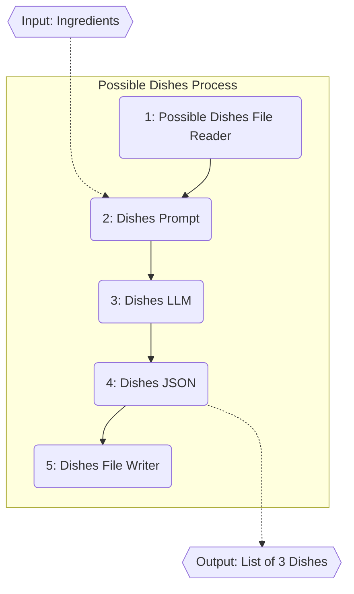
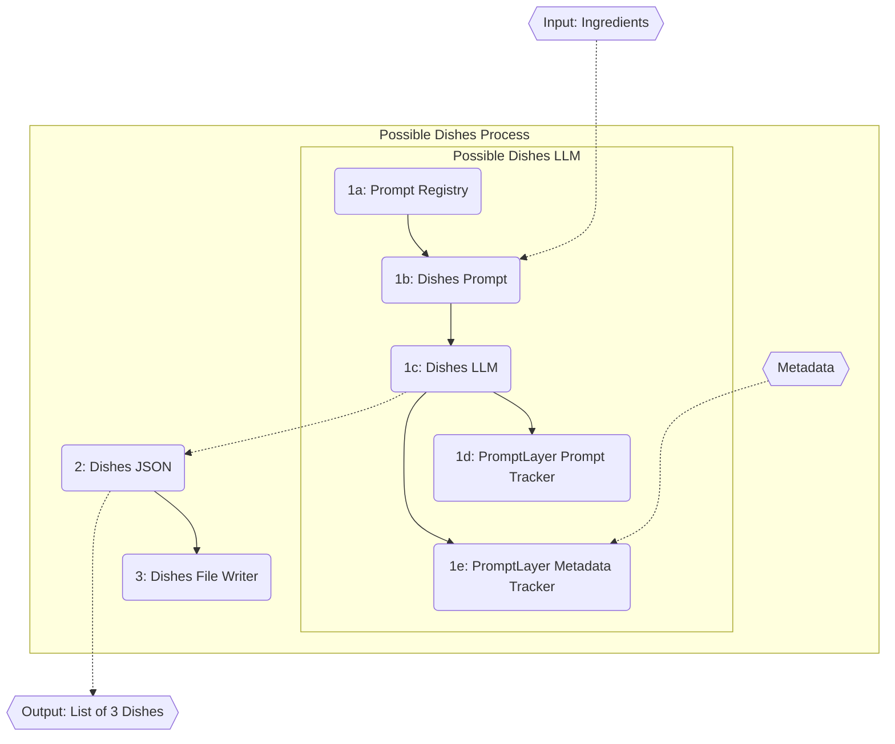

# AIToolkit

AIToolkit is a project that simplifies the creation of pipelines utilizing large language models. 

The core concept is the idea of an AITool. Every object in this library is AITool, and AITools can be connected together in just about any way. AITools can be grouped together as an AIProcess, which is also just an AITool.

Here is a table of some of the basic tools (a more comprehensive table is below)

| Tool | Description |
| ---- | ----------- |
| LLM | An interface to a large language model. A model name and prompt can be specified and the LLM will return the LLM's response. |
| PromptBuilder | A jinja2 style text replacement tool. A template and a dictionary of replacements are specified and this will return a string with the replacements made. |
| APIRequest | A wrapper around the requests package to make requests to an API. Returns the JSON of the response. |
| FileReader | Reads the contents of a file. |
| FileWriter | Writes content to a file. |
| ConvertToJSON | Converts the input from a string to JSON. |

The main goals are this project is to drive both high flexibility and simplicity. While safeguards can be built into pipelines by users to improve robustness, making these pipelines robust is not the goal of this package (there are many other libraries that aim to do this at the expense of flexibility and/or simplicity). This is why some deliberate design decisions have been made such as:

- **Allowing dynamic inputs to any AITool** - All AITools have certain inputs that are required, but most of them have many optional inputs, and support the user defining their own inputs.
- **Allowing all inputs to be dynamic** - while a lot of LLM libraries (i.e. LangChain, etc.) make you configure certain things in the pipeline such as what LLM model is being used, what templates are used for the prompt, etc. ***Everything*** in the AIToolkit can be dynamically set at runtime through another AITool. So you could have one LLM decide what model another LLM uses, or what file a FileReader should read, or even have it write the python code that a Function uses. You could load the template that a PromptBuilder uses from a file, or load the python code that a Function uses from a file. The possibilities are endless!
- **Not enforcing any strict typing on the inputs/outputs** - The user will have to think about how data is being around to ensure type safety as that is not a core feature of this package (it would greatly reduce simplicity)

## Getting Started

The toolkit can be installed using:

`pip install git+https://github.com/Ledgestone/AIToolkit.git`
or
`pdm add git+https://github.com/Ledgestone/AIToolkit.git`

To use the toolkit, you need to import the necessary modules. Here are the typical imports that are probably needed.

```python
from dotenv import load_dotenv, find_dotenv
import ai_toolkit as ai
```

## Setup

Before starting, you need to load your environment variables. This project uses a `.env` file to manage environment variables. Make sure to set this up in your project root:

```python
load_dotenv(find_dotenv())
```

Depending on the model that is used, these are the environment variables that will be needed.
- OPENAI_API_KEY
- RESPELL_API_KEY
- ANTHROPIC_API_KEY
- PROMPTLAYER_API_KEY


## How to Use

### The core of an AITool

Every AITool has 3 functions that are used. `set_input`, `process`, and `get_output`. Let's look at how you would interact with an LLM using this tool.

```python
llm = ai.tools.LLM("My LLM")
llm.set_input(model_name="gpt-3.5-turbo", prompt="What is the capital of France?")
llm.process()
print(llm.get_output())
```

This would return something like: `The capital of France is Paris`. 

Note that all methods are chainable so this would be equivalent to:
```python
p = "What is the capital of France?"
print(ai.tools.LLM("My LLM").set_input(model_name="gpt-3.5-turbo", prompt=p).process().get_output())
```

### Using multiple AITools together

The above example isn't very interesting, since only one AITool is in use. Let's now look at adding in a `PromptBuilder`

```python
prompt_tool = ai.tools.PromptBuilder("My Prompt").set_input(
    template="What is the capital of {{country}}", 
    country="France")

llm_tool = ai.tools.LLM("My LLM").set_input(
    model_name="gpt-3.5-turbo", 
    prompt=prompt_tool)

prompt_tool.process()
llm_tool.process()
print(llm_tool.get_output())
```

As you can see from this example, it is easy to chain together different AITools. Any input can be another AITool, and as long as all inputs have processed, the current AITool will be able to process as well.

### Using an AIProcess

It can become tedious to process several AITools that have been chained together, so AITools can be grouped together using an AIProcess, so that they can all be processed at once as another AITool. This is the pipeline we will be designing:



Let's first define several AITools that we want to group into a process:

```python
dishes_file = ai.io.FileReader("Dishes File Reader").set_input(
    file_path="possible_dishes_prompt.txt")
    
dishes_prompt = ai.tools.PromptBuilder("Dishes Prompt").set_input(
    template=dishes_file)

dishes_llm = ai.tools.LLM("Dishes LLM").set_input(
    model_name="gpt-3.5-turbo", 
    prompt=dishes_prompt)

dishes_json = ai.operations.ConvertToJSON("Dishes JSON").set_input(
    input=dishes_llm)

dishes_file_writer = ai.io.FileWriter("Dishes File Writer").set_input(
    file_path="possible_dishes.json", 
    data=dishes_json)
```

After defining these AITools, let's create our AIProcess:

```python
dish_generator = ai.AIProcess("Possible Dishes Process")
dish_generator.expose_input("ingredients", dishes_prompt)
dish_generator.expose_output(dishes_json)
```

Now we have a dish_generator that has the input `ingredients`, and outputs 3 dishes that it generates as an array. It also saves these dishes to a json file to be able to go back to. The AIProcess automatically determines all AITools in the process by analyzing the links between the AITools defined in the inputs and outputs.

Now we can use the `dish_generator` just like any other AITool:
```python
dish_generator.set_input(ingredients="chicken, rice, and broccoli")
dish_generator.process()
print(dish_generator.get_output())
```

Note again that the input here for `ingredients` could also be another AITool.

## Reusing Composed Processes

After building a set of AITools together it is super easy to reuse the composed AIProcess. All you have to do is create a function that takes in a name and returns this created AIProcess, and then you can create and use them just as any other AITool. See examples of this in ai_toolkit/composed. 

Let's see an example of how we would create the same flow we just created using a composed tool that incorporates retrieving the prompt we want from the PromptLayer registry and then tracking the request using PromptLayer.



```python
dishes_llm = ai.composed.LLMWithPromptRetrievalAndTracking("Possible Dishes LLM").set_input(
    template_name="Possible Dishes",
    model_name="respell-gpt-4-wrapper",
    promptlayer_tags=["Test"],
    metadata={"source": "RecipeMakerPromptLayer.ipynb"},
)
dishes_json = ai.operations.ConvertToJSON("Possible Dishes JSON").set_input(input=dishes_llm)
dishes_file_writer = ai.io.FileWriter("Possible Dishes File Writer").set_input(file_path="possible_dishes.json", data=dishes_json)

dish_generator = ai.AIProcess("Possible Dishes Process")
dish_generator.expose_output(dishes_json)
dish_generator.expose_input("replacements", dishes_llm)

dish_generator.set_input(replacements={"ingredients": "chicken, rice, and broccoli"})
dish_generator.process()
dish_generator.get_output()
```

As you can see in this example, the LLMWithPromptRetrievalAndTracking is a composed object that has several different AITools that it uses, but we are able to set it up and use it just as we would any other AITool.

## Supported AITools

| Package | Tool | Description |
| ------- | ---- | ----------- |
| ai | AIProcess | A process is a collection of AITools and is also an AITool itself.
| ai.tools | LLM | An interface to a large language model. A model name and prompt can be specified and the LLM will return the LLM's response. |
| ai.tools | PromptBuilder | A jinja2 style text replacement tool. A template and a dictionary of replacements are specified and this will return a string with the replacements made. |
| ai.io | APIRequest | A wrapper around the requests package to make requests to an API. Returns the JSON of the response. |
| ai.io | FileReader | Reads the contents of a file. |
| ai.io | FileWriter | Writes content to a file. |
| ai.io | PromptLayerRegistry | Retrieves a prompt template from the PromptLayer registry. |
| ai.io | PromptLayerPromptTracker | Tracks the usage of a prompt template. |
| ai.io | PromptLayerGroupCreator | Creates a new PromptLayer group. |
| ai.io | PromptLayerGroupTracker | Tracks a request by adding it to a PromptLayer group. |
| ai.io | PromptLayerMetadataTracker | Tracks a request by adding metadata to it. |
| ai.operations | ConvertToJSON | Converts the input from a string to JSON. |
| ai.operations | Passthrough | Takes an input and passes it through to the output. Useful for changing the name of an input for another AITool. |
| ai.operations | ExtractKey | Takes a dictionary and a key name and returns the value of the dictionary indexed at the given key name. |
| ai.operations | Calculator | Executes a single line of python code and returns the result. |
| ai.composed | PromptAndLLM | A composition of the PromptBuilder and LLM tools. Takes in a model name, prompt template, and replacements dictionary and it will return the LLM's response |
| ai.composed | LLMWithPromptRetrievalAndTracking | An integration of the LLM tool with many of the PromptLayer tools. This will retrieve a prompt from the PromptLayer registry, perform replacements, and track the LLM request with PromptLayer. It returns the LLM's response. |

## Custom Code Blocks

TODO: Create example of using a custom code block

## Roadmap (Right now just a list of goals)
- Create a loop tool that wraps around another tool and performs some operation multiple times over that tool
    - Allow the loop tool to specify a certain number of threads to allow parallelization
- Create a retry tool that checks a certain condition and if that condition is not satisfied it will try running the tool again
- Better implementation of PromptLayer to track any request to LLMs instead of just openai models
    - Need to find simple way of associating PromptLayer requests with the prompt template that was used
- Implement automated retries for common errors with LLMs, with support for a timout period
- Add a `.debug()` function to AITool that will nicely log the inputs and outputs of any AITool, with the option to specify a file to save these logs to.
- Add better documentation so that on hover it is easy to see what the inputs are for any given AITool, along with examples of valid inputs (especially for LLM & Function)
- Create an example of how you would set up an AIProcess that automatically adjusts which LLM Model is used depending on the number of tokens in the prompt.
- Create an AITool for interacting with a key/value store database
- Create an AITool for creating and retrieving embeddings
- Handle status code's that aren't 200 more gracefully in APIRequest
- If there is a way to allow an AITool to automatically index into a dictionary so the ExtractKey tool isn't necessary, it might simplify the code
- Create an example auto-fixing output parser that will try to convert an output to match some schema and if it doesn't work then it will use an llm to fix the output
- Test the calculator - set up an example where an LLM output goes into the calculator
- Allow exposing optional inputs with an AIProcess
